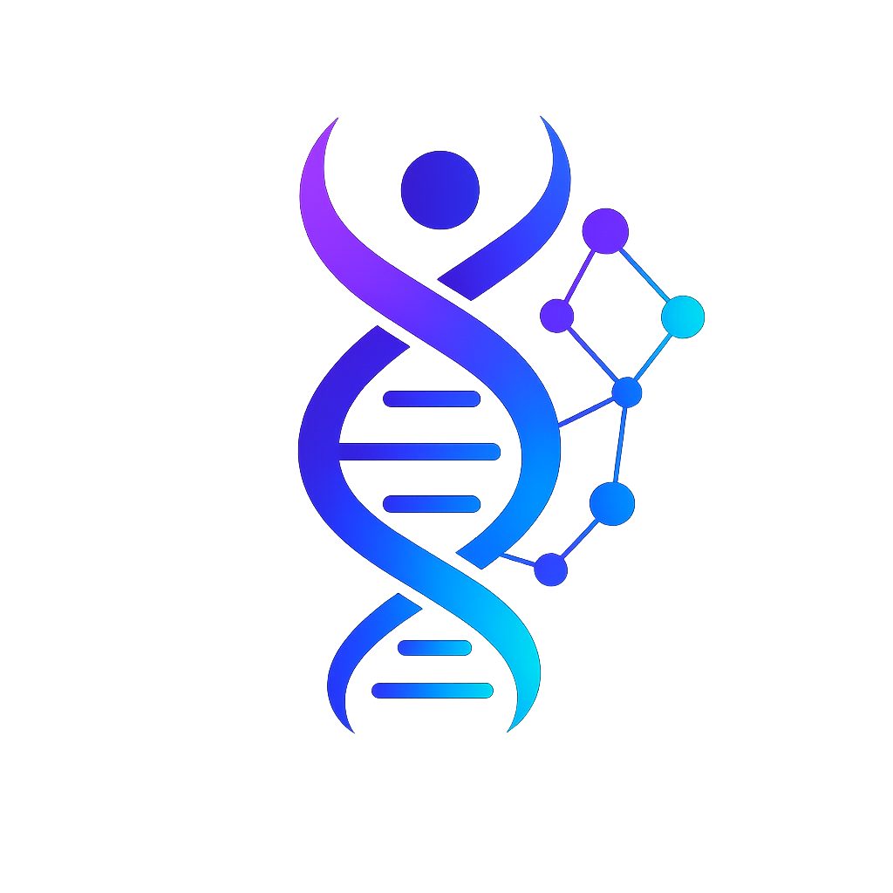

<div align="center">
  
  
  # EpiGeniX
  
  **Decode Your Epigenetic Risk Landscape**
  
  A modern, interactive platform that maps genetic variants (SNPs) to disease risk, powered by explainable models and real-time scenario simulations.
  
  <p align="center">
    
    
    
  </p>
</div>

---

## 🧬 Overview

EpiGeniX is an advanced web application designed for researchers, clinicians, and health enthusiasts who want actionable genetic insights. It takes patient genomic data and visually models the risk for complex conditions like **Type 2 Diabetes**, **Crohn's Disease**, and **Alzheimer's Disease**. 

By combining pure genetic predispositions with real-time, modifiable environmental factors (such as sleep, diet, and exercise), EpiGeniX provides a comprehensive, holistic view of a patient's risk profile through an intuitive and "glassmorphic" biotech UI.

## ✨ Key Features

- **📊 Live Risk Modeling**  
  Interactive sliders allow users to compute risk in real-time. Adjust lifestyle factors to simulate how modifiable behaviors can mitigate inherent genetic risks.
  
- **🧬 Genomic Analysis Integration**  
  Upload patient scan files (`.json`, `.csv`, `.tsv`) to automatically extract genotype data. EpiGeniX maps specific SNP variants (like *TCF7L2*, *APOE*, and *NOD2*) directly to disease algorithms.

- **🧠 Explainable UI**  
  No black boxes. The platform clearly explains exactly *which* genetic markers and lifestyle factors are driving the risk score and by how much.
  
- **🫀 Dynamic Anatomy Mapping**  
  A completely custom, dynamic SVG anatomy visualization engine maps genetic markers directly to the affected anatomical organs (Pancreas, Brain, Intestine), scaling dynamically based on risk severity.

- **💾 Scenario Comparison**  
  Save a "Baseline" risk score and compare it against an "Improved" simulated score to visually track potential health outcomes.

## 🚀 Getting Started

### Prerequisites

Make sure you have [Node.js](https://nodejs.org/) installed on your machine.

### Installation

1. **Clone the repository:**
   ```bash
   git clone https://github.com/hoppercraft/EPIGENIX.git
   cd EPIGENIX
   ```

2. **Install dependencies:**
   ```bash
   npm install
   ```

3. **Run the development server:**
   ```bash
   npm run dev
   ```

4. **Open your browser:**  
   Navigate to `http://localhost:5173` to see the application running.

## 🗂 Data Upload Format

EpiGeniX accepts CSV, TSV, or JSON files. To successfully load a patient profile, ensure your data includes:
- A `disease` or `diagnosis` field (e.g., `"disease": "Type 2 Diabetes"`).
- An array of `variants`, containing `gene`, `rsid`, and `genotype`.

**Example JSON format:**
```json
{
  "patient_id": "PT-7890",
  "disease": "Type 2 Diabetes",
  "variants": [
    { "gene": "TCF7L2", "rsid": "rs7903146", "genotype": "TT" },
    { "gene": "FTO", "rsid": "rs9939609", "genotype": "AA" }
  ]
}
```

## 🛠 Tech Stack

- **Frontend Framework:** React 18
- **Build Tool:** Vite
- **Styling:** Tailwind CSS (with custom utility tokens for advanced glassmorphism)
- **Routing:** React Router v6
- **Icons:** Custom SVG components

## 🎨 Design System

EpiGeniX leverages a deeply customized, dark-mode biotech aesthetic:
- **Glassmorphism:** Heavy use of backdrop-blurs and translucent surface colors to give a modern, layered feel.
- **Micro-interactions:** Seamless CSS and React-driven transitions ensure elements respond fluidly to user input without layout thrashing.
- **Color Psychology:** Strictly defined risk variables (`--risk-high`, `--risk-low`) to subconsciously guide the user's understanding of the data.

## 🤝 Contributing

Contributions are welcome! If you have ideas for new disease models, better algorithms, or UI improvements:

1. Fork the Project
2. Create your Feature Branch (`git checkout -b feature/AmazingFeature`)
3. Commit your Changes (`git commit -m 'Add some AmazingFeature'`)
4. Push to the Branch (`git push origin feature/AmazingFeature`)
5. Open a Pull Request

---

<div align="center">
  <i>Built with 🧬 to bring genetic data to life.</i>
</div>
